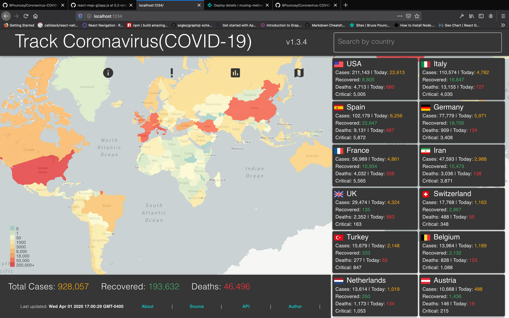
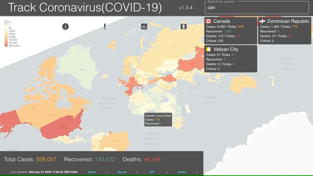
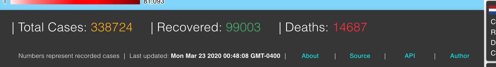

# :heavy_exclamation_mark: Track Coronavirus(COVID-19) v1.4.1
## [trackcoronavirus.info](https://trackcoronavirus.info) 



### Run locally
Clone project <br>
run ```yarn``` in the project directory to install all dependancies <br>
```yarn start``` to spin up a local server <br>
View at ```localhost:1234/```<br>

### Technologies used
* [JS ES6](http://es6-features.org/)
* [React](https://reactjs.org/)
* [JSS](https://cssinjs.org/?v=v10.0.4)
* [Material-UI](https://material-ui.com)
* [Parcel](https://parceljs.org/)

### Endpoints:
* Map - [Google GeoCharts](https://developers.google.com/chart/interactive/docs/gallery/geochart)
* Coronavirus(COVID-19) data - [NovelCOVID/API](https://github.com/NovelCOVID/API)
* countryByGeo Codes - [datahub.io/core/countryByGeo-list](https://datahub.io/core/countryByGeo-list)
* countryByGeo Flags - [countryByGeoflags.io/](https://www.countryByGeoflags.io/)
* Mapbox - [mapbox.com](https://www.mapbox.com)
* Geo-Json-World - [github.com/BPouncey/geo-json-world](https://github.com/BPouncey/geo-json-world)

### Media Query Breakpoints
| Device      | Width         | Height        | 
|:-----------:|:-------------:|:-------------:|
| Mobile      | 414           | 896           |
| Tablet      | 768           | 1024          |
| Desktop     | 1400          | 800           |

## API Tutorial:
```javascript
import React, { useState, useEffect } from 'react'

import { useStyles } from './totals.styles'

const Totals = () => {
    const classes = useStyles()
    const [data, setData] = useState([])
    const [isLoading, setLoading] = useState(false)

    useEffect(() => {
        getData()
    }, [])

    const getData = async () => {
        setLoading(true)

        const result = await fetch(`
            https://corona.lmao.ninja/all
        `)

        const data = await result.json()

        if (data.error) {
            console.log("error", data.error)
        } else {
            setData(data)
        }
        setLoading(false)
    }

    return (
        <div className={classes.root}>
            {!isLoading && (
                data.map((item, index) => {
                    <h3>{item.countryByGeo}</h3>
                    <p>{item.cases}</p>
                })
            )}
        </div>
    )
}

export default Totals
```

## Features

### :mag:  Dynamic search engine
Making use of the React ```useState()``` hook to make an event based search engine. <br>


### :world_map:  Data Driven Styling
Using my endpoint data, I create dynamic data driven styling to associated parameters, in my [mapbox.com](https://www.mapbox.com) / [Geo-Json](https://github.com/BPouncey/geo-json-world) / [NovelCOVID/API](https://github.com/NovelCOVID/API)) merged data to dynammically create a real-time data visualisation of COVID-19 cases around the world.<br>


``````javascript
    const getData = async () => {
        setLoading(true)
        await requestJson(
           'https://bpouncey.github.io/geo-json-world/custom.geo.json',
            (error, response) => {
                if ( !error ) {

                response.features.map( countryByGeo => {
                    covidData.map(countryByCovid => {
                        if ( countryByGeo.properties.iso_a3 === countryByCovid.countryByCovid.countryInfo.iso3 ){

                            countryByGeo.properties = { 
                                ..countryByCovid, 
                                ...countryByGeo.properties
                             }
                        }
                    })
                    if (!countryByGeo.properties.cases) {
                        countryByGeo.properties.cases = 0
                    }
                })
                setState({data: response})
                } else { 
                    console.log(error)
                }
                setLoading(false)
            }
        )
    }
``````

### :chart_with_upwards_trend: Totals display 


## :exclamation: About
Due to the panic and fear in society I created this accesible application to provide correct infomation, on every countryByGeo where data has been recorded. Please also know, the data shown is recorded infomation, unrecorded infomation will not be shown. 
<br>
Track Coronavirus(COVID-19) is an independently developed, free to use web application :heavy_check_mark:

## Environment
* macOS catalina: 10.15.3
* VS Code: 1.39.1

## Authors
* **Bruce Pouncey** - *Initial work* - [BPouncey](https://github.com/BPouncey)

## License
(MIT)

## Acknowledgments
@[NovelCOVID](github.com/NovelCOVID)
